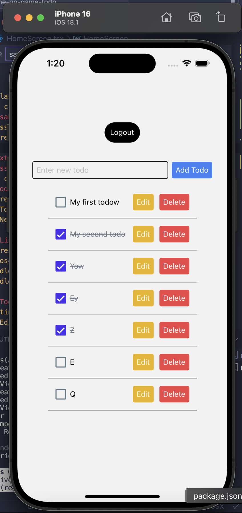
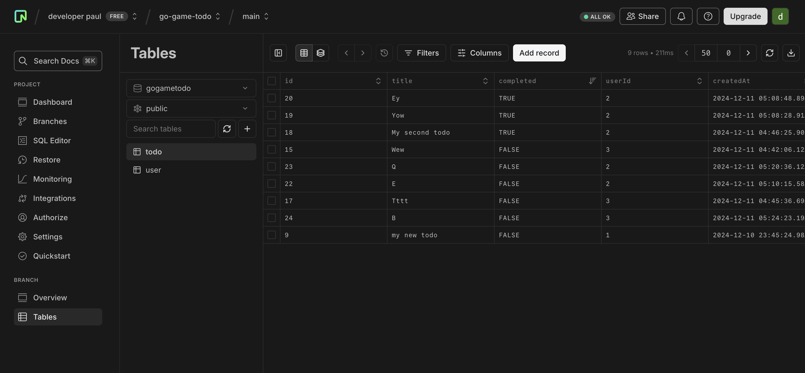

## Project Structure

```
the-go-game-todo/
├── mobile/                 # React Native Expo app
│   ├── src/
│   │   ├── api/
│   │   ├── components/
│   │   ├── hooks/
│   │   ├── screens/
│   ├── App.tsx
│   └── package.json
└── server/                 # NestJS backend
    ├── src/
    │   ├── auth/
    │   ├── todos/
    │   ├── users/
    │   └── main.ts
    └── package.json
```

## Setup Instructions

### Prerequisites

1. Node.js (v18 or later, I used nvm 20.9.0)
2. PostgreSQL - Neon Database Account (neon.tech create a project)
3. Expo Go

### Frontend Setup

```bash
# Install dependencies
cd mobile
yarn install
yarn start
```

### Backend Setup

```bash
# Install dependencies
new terminal
cd server
yarn install
yarn start
```

### Environment Setup

1. Create `.env` file in the mobile directory:

```
EXPO_PUBLIC_API_URL=your-api-url ex. http://localhost:3000
You can use my deployed backend on railway: https://the-go-game-todo-production.up.railway.app/
```

2. Create `.env` file in the server directory:

```
DATABASE_URL=your-neon-database-url // ex. postgresql://.........
JWT_SECRET=your-jwt-secret-key // ex. anycharacter
```



